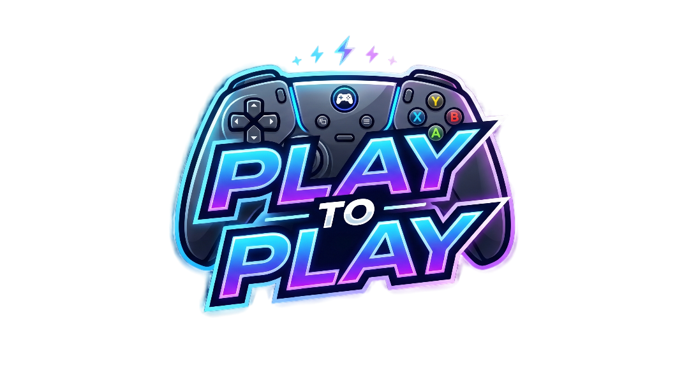

# 🎮 PlayToPlay | Proyecto Intermodular SMR

  

¡Bienvenidos a mi repositorio! Este es el resultado de mi proyecto integrador para el ciclo de **Sistemas Microinformáticos y Redes (SMR)**. 

**PlayToPlay** no es solo una simulación de una tienda de informática; es un ecosistema diseñado para unir el mundo del hardware de alto rendimiento con la gestión empresarial y la competición de eSports. El objetivo principal ha sido crear una infraestructura técnica real, escalable y visualmente coherente, donde cada módulo del ciclo formativo aporta una pieza clave al rompecabezas.

🔗 **[🌐 >> Visita la Web Oficial de PlayToPlay aquí <<](https://playtoplay.netlify.app/)**

---

## 🚀 El Concepto: PlayToPlay

PlayToPlay nace de la necesidad de ofrecer un espacio 360° para el gamer. Dividimos el negocio en dos grandes áreas:
1.  **Zona Comercial:** Venta de videojuegos, periféricos y hardware montado a medida bajo demanda.
2.  **Espacio Premium:** Un área de alto rendimiento equipada con la última tecnología para torneos presenciales (como nuestro evento de *Rocket League*), donde la latencia mínima y la potencia extrema son los protagonistas.

---

## 📂 Estructura del Proyecto por Asignaturas

El proyecto es totalmente intermodular. Puedes explorar los detalles técnicos de cada área en los siguientes enlaces a las carpetas del repositorio:

### 🛠️ [Montaje y Mantenimiento de Equipos](https://github.com/RosarioGPerea/Proyecto_Intermodular-Rosario_Gragero_Perea-Ro_G./tree/main/Montaje_y_Mantenimiento)
En este módulo me encargué de la selección crítica de componentes. Diseñé configuraciones que van desde la **Gama Gestión** (optimizada para la administración con el Ryzen 7 5700G) hasta la **Gama Ultra eSports** (equipos con Ryzen 9 9950X3D y placas X870E AORUS), asegurando un equilibrio entre inversión y rendimiento.

### ⚙️ [Sistemas Operativos Monopuesto](https://github.com/RosarioGPerea/Proyecto_Intermodular-Rosario_Gragero_Perea-Ro_G./tree/main/Sistemas_Operativos_Monopuesto)
No basta con el hardware; el software debe estar a la altura. Aquí detallo la instalación limpia de Windows 11 Pro, la gestión de perfiles administrativos y la optimización de servicios para reducir el *input lag* en los puestos de juego.

### 🌐 [Redes Locales](https://github.com/RosarioGPerea/Proyecto_Intermodular-Rosario_Gragero_Perea-Ro_G./tree/main/Redes_Locales)
Diseño y despliegue de una red en estrella con tecnología Gigabit y WiFi 6. Implementé segmentación para garantizar que el tráfico de los torneos no interfiera con la gestión administrativa, logrando pings estables por debajo de los 5ms.

### 📊 [Bases de Datos](https://github.com/RosarioGPerea/Proyecto_Intermodular-Rosario_Gragero_Perea-Ro_G./tree/main/Bases_de_Datos)
El "cerebro" de PlayToPlay. Diseñé un modelo relacional que conecta el inventario de la tienda con las inscripciones a los torneos y las ventas a clientes, automatizando el flujo de información entre todas las áreas del negocio.

### 📁 [Aplicaciones Ofimáticas](https://github.com/RosarioGPerea/Proyecto_Intermodular-Rosario_Gragero_Perea-Ro_G./tree/main/Aplicaciones_Ofimaticas)
Centralización de toda la documentación técnica, presupuestos, guías de torneos y manuales corporativos, manteniendo una línea visual profesional y homogénea.

### 💼 [Itinerario Personal para la Empleabilidad](https://github.com/RosarioGPerea/Proyecto_Intermodular-Rosario_Gragero_Perea-Ro_G./tree/main/Itinerario_Personal_Empleabilidad)
Análisis del mercado laboral actual, desarrollo de mi marca personal y planificación de mi carrera hacia el sector del diseño y la tecnología.

---

## 👩‍💻 Sobre mí: Rosario Gragero Perea (Ro G.)

Vengo de un entorno puramente creativo (pintura, fotografía, dibujo), lo que me aporta una visión estética diferencial en el sector tecnológico. Me considero una persona **"manitas"**: me apasiona abrir un equipo, entender cómo funciona y montarlo desde cero, pero también disfruto enormemente dándole vida a las ideas mediante HTML y CSS.

Actualmente compagino 1º de SMR con un Máster de Especialización en Programación, buscando siempre el punto de equilibrio donde la potencia técnica y el arte se encuentran.

### 🎯 Mi Norte Profesional
Mi meta al finalizar mis estudios es especializarme en **Diseño de Interfaces (UI/UX)** enfocado a sectores artisticos y/o de videojuegos. Creo firmemente que una tecnología potente solo es útil si es intuitiva y visualmente impecable. Busco roles donde la creatividad sea un activo y el detalle técnico sea la norma.

---

## 📸 Capturas del Proyecto

| Interior | Fachada del Local |
| :---: | :---: |
|  |  |

---

> "Durante el desarrollo de PlayToPlay, lo más valioso ha sido entender que todo está conectado: una mala elección de hardware afecta al stock en la Base de Datos, y necesita un Sistema Operativo y una red configurados a medida para brillar en competición."

---

  1º SMR - Rosario Gragero Perea (Ro G.) - 2026

